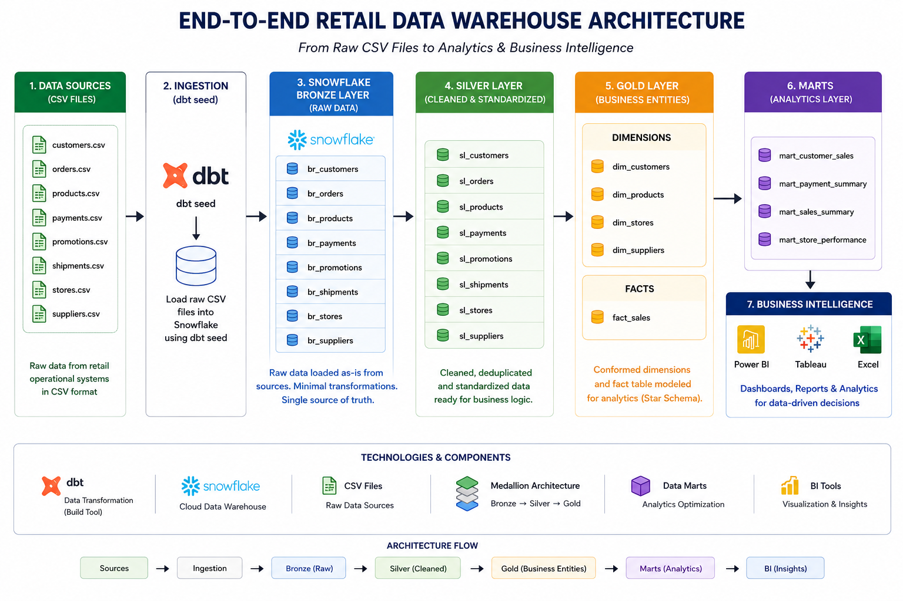
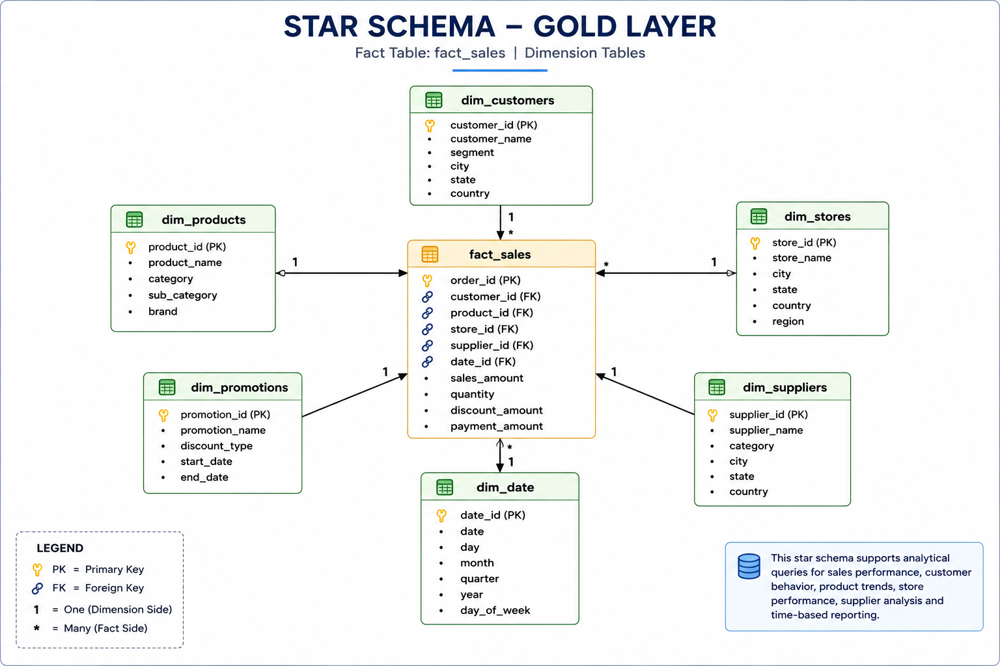
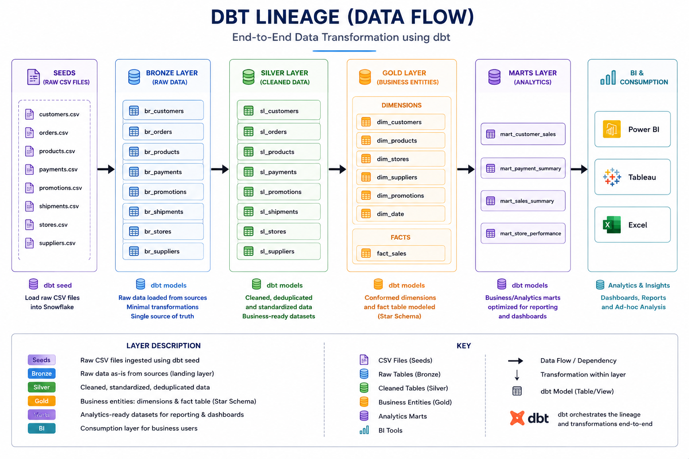

# 🚀 End-to-End Retail Data Warehouse using dbt & Snowflake
> A production-style Retail Data Warehouse built using Snowflake, dbt, SQL, and Python that demonstrates modern Data Engineering practices including layered architecture, Star Schema design, Fact & Dimension modeling, Business Marts, Git version control, and analytics-ready data pipelines.

## 📌 Project Overview
This project demonstrates the design and implementation of a modern Retail Data Warehouse using Snowflake and dbt.

The solution follows a layered architecture that transforms raw operational data into analytics-ready models that are consumed by interactive Power BI dashboards.

---

## ✨ Project Features

- End-to-End Retail Data Warehouse
- Snowflake Cloud Data Platform
- dbt Layered Architecture (Bronze → Silver → Gold)
- Star Schema Data Modeling
- Fact & Dimension Tables
- Business Data Marts
- dbt Seeds & Sources
- dbt Snapshots
- Data Quality Testing
- Git Version Control
- Power BI Dashboard

## 🎯 Objectives

- Build a production-style Data Warehouse
- Implement Bronze, Silver and Gold layers
- Design Star Schema
- Create Fact and Dimension models
- Build Business Marts
- Demonstrate dbt best practices
- Prepare a portfolio-ready Data Engineering project

## 🔄 Data Flow

CSV Files

↓

Snowflake RAW Layer

↓

Bronze Models

↓

Silver Models

↓

Gold Models

↓

Business Marts

↓

Power BI Dashboard

## 🏗️ Solution Architecture



---

## ⭐ Star Schema




---

## 🔄 dbt Lineage




---

## 🛠 Technology Stack

| Category | Technology |
|----------|------------|
| Cloud Data Warehouse | Snowflake |
| Data Transformation | dbt Core |
|Programming & Transformation | SQL + dbt (Jinja)
| Version Control | Git & GitHub |
| IDE | VS Code |
| Visualization | Power BI |
| Documentation | dbt Docs |

---

## ✅ Data Quality & Testing


Data quality is validated at every layer using dbt's built-in and custom tests to catch issues early in the pipeline.

- **Generic tests**: `not_null`, `unique`, `relationships`, and `accepted_values` applied across Silver and Gold layer models to enforce schema integrity and referential accuracy
- **Custom singular tests**: business-rule validations (e.g., no negative order quantities, valid date ranges) written to catch domain-specific data issues
- **Source freshness checks**: configured to flag stale data from upstream sources
- **Test coverage**: tests run automatically as part of `dbt test`, with results reviewed before promoting models to the Gold layer

This mirrors real-world ETL QA practice — validating data at each transformation stage rather than only at the final output.

---

## ▶️ How to Run This Project

### Prerequisites

Before running the project, ensure you have:

- Python 3.10+
- dbt Core with the Snowflake adapter
- A Snowflake account
- Git
- VS Code (or any preferred IDE)

### Setup & Execution

```bash
# 1. Clone the repository
git clone https://github.com/abhishek-srivastava-dbt/dbt-retail-datawarehouse.git
cd dbt-retail-datawarehouse

# 2. Install project dependencies
dbt deps

# 3. Configure your Snowflake connection
# Update ~/.dbt/profiles.yml with your Snowflake credentials

# 4. Verify the connection
dbt debug

# 5. Load seed data
dbt seed

# 6. Build the complete data warehouse
# (Runs models, tests, snapshots, and seeds in dependency order)
dbt build

# 7. Generate documentation and lineage
dbt docs generate

# 8. Launch the documentation site
dbt docs serve

# 9. Run only models
dbt run

# 10. Run only tests
dbt test

# 11. Refresh incremental models
dbt build --full-refresh
```

---

## 💡 Key Learnings & Challenges

- Designing a **layered Bronze/Silver/Gold architecture** required careful thought on where transformation logic belongs vs. where raw data should stay untouched
- Building a **Star Schema** meant resolving grain mismatches between fact and dimension sources before modeling
- Writing **custom dbt tests** surfaced real data quality edge cases (nulls, duplicates, orphaned keys) that generic tests alone wouldn't catch
- Using **dbt lineage graphs** made it much easier to trace downstream impact before changing an upstream model — a habit directly transferable to production ETL testing

## 📂 Project Structure

```text
dbt_learning
│
├── diagrams
│   ├── architecture.png
│   ├── star_schema.png
│   └── dbt_lineage.png
│
├── models
│   ├── bronze
│   ├── silver
│   ├── gold
│   │   ├── dimensions
│   │   └── facts
│   └── marts
│
├── macros
├── seeds
├── snapshots
├── tests
├── README.md
└── dbt_project.yml
```

## 🚀 Future Enhancements

- CI/CD using GitHub Actions
- Incremental Models
- Snowflake Tasks
- Streams
- Automated Data Loading
- dbt Cloud Deployment
- Data Observability


## 👨‍💻 Author

**Abhishek Kumar Srivastava**

Senior QA Automation Engineer | Aspiring Data Engineer

Skills:
- Snowflake
- dbt
- SQL
- Python
- Power BI
- Git

GitHub:
https://github.com/abhishek-srivastava-dbt

LinkedIn:
(https://www.linkedin.com/in/sriabhisheksrivastava/)